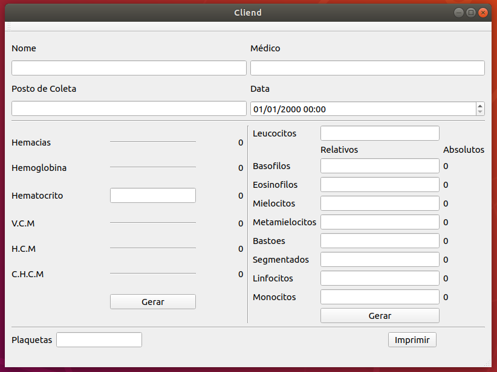
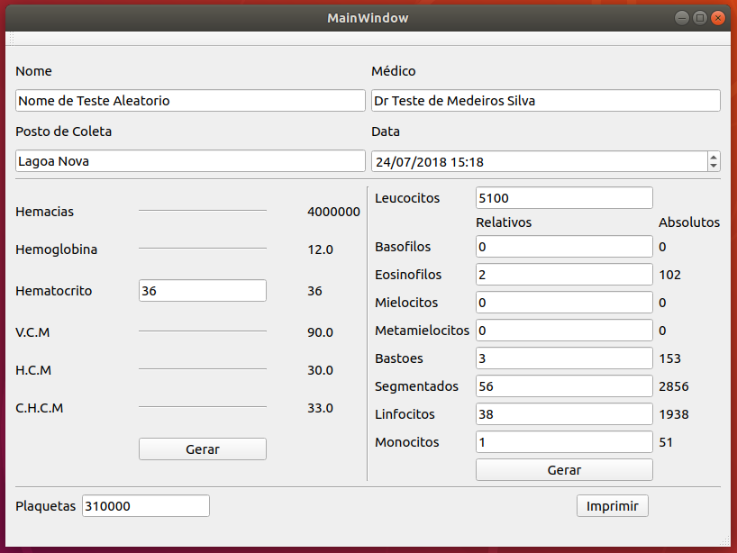

# ProjetoCliend
Repositorio destinado ao programa desenvolvido sobre encomenda para a clinica CLIEND que se localiza em Natal-RN.

O programa facilita o trabalho de um bioquimico auxiliando na produção de um hemograma completo do paciente a partir poucos dados, realizando todos os calculos necessarios para achar os demais dados e imprimir em formato PDF em uma subpasta do programa chamada Exames. Nessa pasta o arquivo é salvo como datanomedopaciente.PDF.

O programa foi desenvolvido em PYQT e recebe como entrada o nome do paciente, nome do medico, posto de coleta, data e hora. Além disso o programa para calcular a serie vermelha (hemacias, hemoglobina, VCM, HCM, CHCM) recebe como entrada o valor do hematocrito. Já para calcular a serie branca (leucocitos, mielocitos, metamielocitos, bastoes, segmentados, eosinofilos, basofilos, linfocitos e monocitos) o programa recebe como entrada o valor relativo dos mesmo e calcula o valor absoluto. O programa tambem recebe como entrada a contagem de plaquetas.

Abaixo segue imagens do programa sendo utilizado e o link para o resultado em PDF do exame teste gerado por ele.

Imagem do programa logo apos ser aberto:

Imagem do programa preenchido com entradas:

Link para o arquivo em PDF: 

